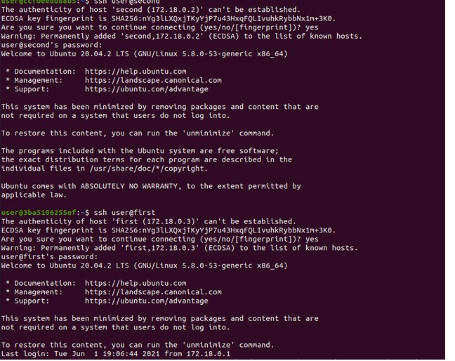
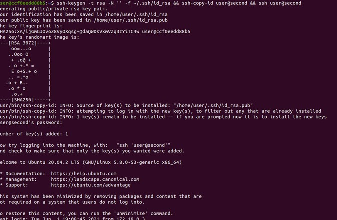
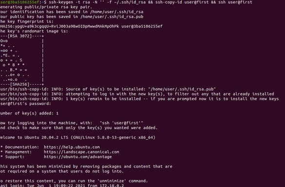
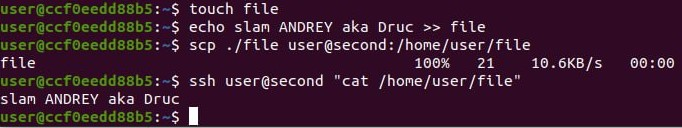
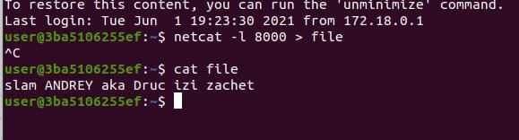
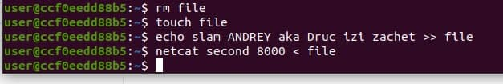

## Практические задания

1. Сделать image контейнера с необходимым ПО для запуска sshd. Запустить docker-compose поднять два ssh сервера

```bash
$ docker-compose build && docker-compose up
```

2. Продемонстрировать что из одного контейнера можно войти в другой
	- По паролю:
	
	
	
	- По ключю:
	
	
	
	

3. Выполнить команду

	
	
4. Передать файл
	
	
	
5. Продемонстрировать простейший обмен данными с помощью утилиты netcat
	
	
	
	