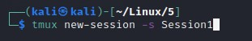
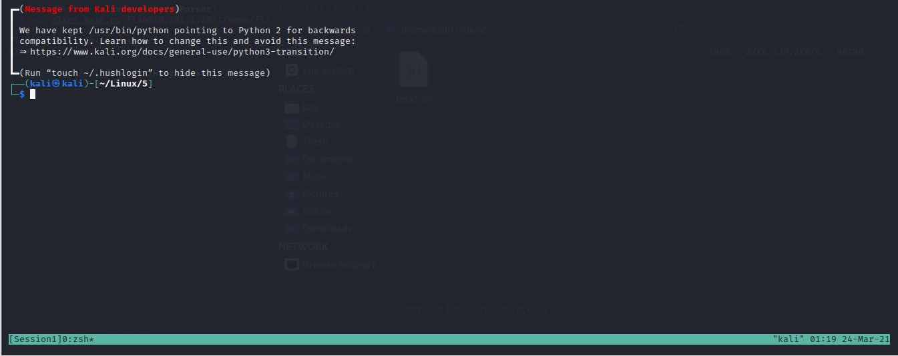
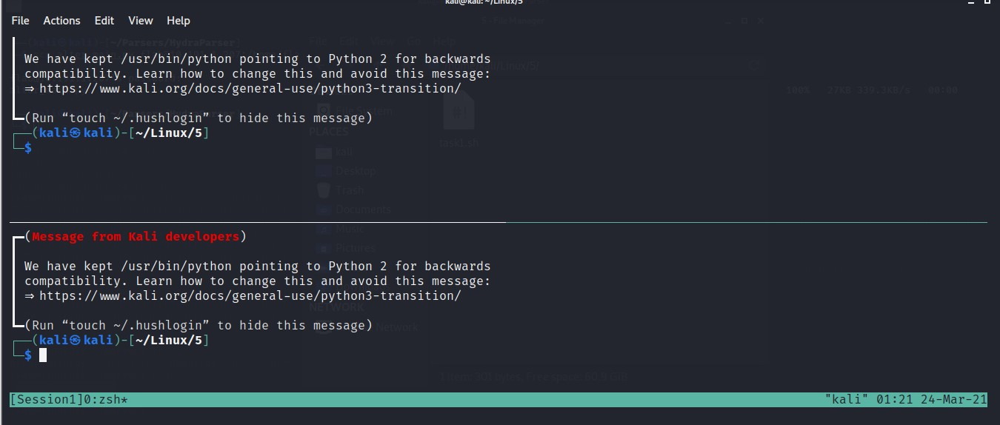
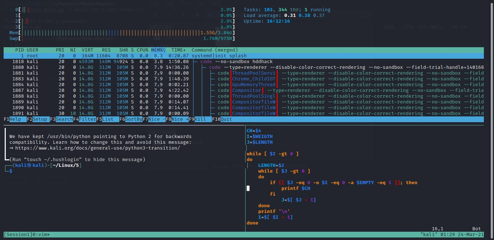

1. Как отобразить 4 последних выполненных команды?
	---
	history 4

---

2. Перевести задание в фоновый режим в bash можно командой
	---
	bg pid

---

3. Какая комбинация клавиш переключит вас на 4-ю виртуальную консоль?
	---
	ctrl+alt+f4

---

4. Какая переменная среды содержит путь к домашнему каталогу?
	---
	HOME

---

5. Установить в bash переменную MYVAR в качестве системной можно командой?
	---
	export MYVAR

---

6. Какие комбинации клавиш позволят выделить несколько файлов в Midnight Commander?
	---
	ctrl+t

---

7. Что выведет на экран этот сценарий?
	---
	```#!/bin/bash
	VAR=`echo 'test'`
	VAR2=`echo '$VAR'`
	echo $VAR2
	```
	---
	Выведет $VAR
	
---

8. Что выведет на экран это сценарий?
	---
	```#!/bin/bash
	cd /etc
	VAR="$PWD"
	if [ -n "$VAR" ]; then
	 echo "$VAR"
	else
	 echo '$VAR'
	fi 
	```
	---
	Выведет /etc
 
---

9. Что выведет на экран этот сценарий?
	---
	```#!/bin/bash
	A=1
	B=2
	if [ $A -eq $B  ]; then
	 echo '$A'
	else
	 echo "$B"
	fi
	```
	---
	Выведет 2

---

Практическое задание №2

---

1. Создали новую сессию с именем Session1:
	---
	
	---
	
	
---

2. Создали новую панель по вертикали комбинациями Ctrl+b и Shift+", создали новую панель по горизонтали комбинациями Ctrl+b Shift+%:
	---
	
	---
	
	
---

3. Отключились от текущей сессии комбинацией Ctrl+b+d.

---

4. Для управления мышью и прочих удобств, создаем файл конфига .term.conf

---


	