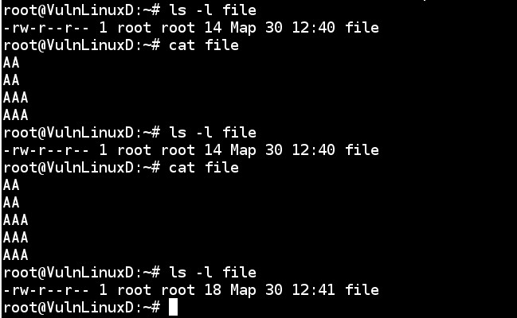

1. Какие команды позволяет установить задания планировщика?
	---
	at <time> <date>
	---
	crontab -e <command>
	
---
	
2. Что сделает Команда atrm 7?
	---
	Удалит задачу с номером 7
	
---
	
3. Какая команда позволяет установить планировщику crontab задания из файла jobs?
	---
	crontab jobs
	
---
	
4. Когда будет готово задание 19 */2 13 * 5 job.sh ? 
	---
	По пятницам 13-го на 19-й минуте каждого четного часа
	
---

5. Напишите cron строку установленной на выполнение скрипта job.sh с января по май, в 01:00 по воскресеньям 
	---
	0 1 * 1-5 7 job.sh
	
---
	
6. Просмотреть список всех смонтированных разделов можно командой?
	---
	mount
	
---

7. Описать работу vim (выход, сохранение, поиск, замена строк, удаление строк (полностью частично)).
	---
	1. Чтобы выйти из редактора (Ctrl+"), чтобы вызвать консоль: :q
	---
	2. Чтобы выйти из редактора без сохранения, но при этом были изменения в файле: :q!
	---
	3. Выйти из редактора и сохранить: :wq
	---
	4. Для поиска символа в текущей строке, надо нажать f и ввести символ. Для поиска во всем файле, надо нажать / и ввести слово.
	---
	5. Для замены строки надо ввести :%s/что/на_что (% - чтобы обработать весь файл), еще можно добавить опцию - 'c', чтобы каждый раз редактор спрашивал.
	---
	6. Для удаления строк можно нажать d - для удаления одного символа, dd - для удаления всей текущей строки или D - для удаления от курсора до конца строки.
	
---
	---
	Практические задания
	---
---

1. 

---

2. задание задачи на вывод в файл каждую минуту: * * * * * /root/srcipt.sh
	---
	
	---
	для удаления вводим crontab -r
	
---

3. 

---
	
