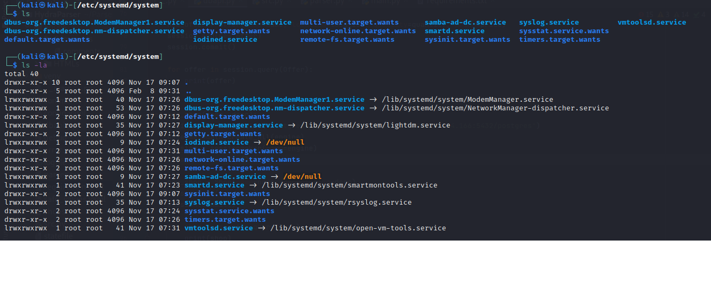

1. Размер MBR - 512 байт. Содержит код и данные, необходимые для загрузки ОС. После отрабатывания кода BIOS, управление передается на MBR, который расположен по CHS адресу - 001 и оканчивается сигнатурой 0xAA, 0x55. Код помещается по физическому адресу 0x7c00.

---

2. Сколько разделов поддерживает MBR? 4 первичных раздела, причем, если есть расширенные разделы, то последний первичый являяется ссылкой на список расширенных. 

---

3. Описать процесс загрузки все этапы на bios и uefi. 
	---
	BIOS:
		- этап инициализиции и проверки оборудования
		- загрузка в режиме BIOS
		- загрузка модуля поддержки совместимости
		- передача управления MBR
	---
	UEFI:	
		- Security Phase
		- Pre-EFI Initialization
		- Среда для исполнения драйверов
		- Boot Device Select
		- Transient System Load
		- Runtime

---

4. Описать порядок загрузки ОС на sysVinit и systemd.
	---
	sysvinit:
		- Установка права на запись для группы и остальные биты в umask
		- Происходит системный вызов reboot() с параметром RB_DISABLE_CAD для ядра, чтобы послать SIGINT процессу с pid'ом 1
		- ioctl() с KDSIGACCEPT и SIGWINCH процессу с pid'ом 1
		- Закрытие всех i\o потоков (stdin, stdout, stderr)
		- PATH -> /sbin:/usr/sbin:/bin:/usr/bin
		- Создание /var/run/utmp с правами 0644
		- Инициализация inittab
		- Вызов init
		- Выяснение текущего runlevel'a по умолчанию (либо запрос его у юзера)

	systemd:
		- вызов default.target
		- вызов тасков из /etc/systemd/system/multi-user.target.wants
		- вызов sysinit.target
		- вызов local-fs.target
		- вызов остальных всех тасков

---

5. 

---

6. Точка монтирования - это?
	Каталог или файл, с помощью которого обеспечивается доступ к новой файловой системе, каталогу или файлу 
	
---

7. Символом "-" обозначается тип файла?
	обычный файл

---

8. Текущее положение в файловой системе можно просмотреть командой?
	pwd

---	

9. Как сделать рекурсивное копирование каталога?
	cp -R
	
---
	
10. Какие команды предназначены для создания элементов файловой системы
	создание каталога: mkdir 
	создание файла: 
		touch
		cat

---

11. Домашний каталог суперпользователя находится по адресу?
	/root

